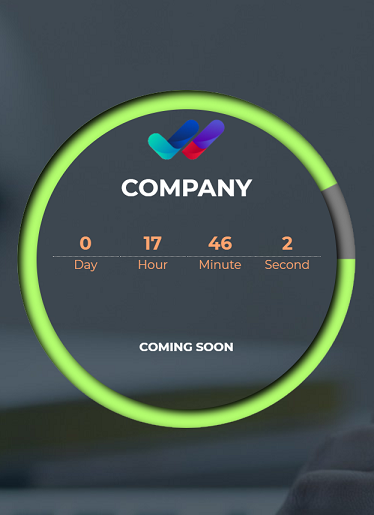

# Countdown

A Simple, Responsive JavaScript Countdown to Date which has a graph.


## Screenshots




## Get start

Download or clone the project and change the following lines in "js/script.js" file.
```js
const deadline = new Date('2020-12-03T19:00:00.000Z'); // Austrian Time Zone
const days = 10; // Total days
```

## Authors

Contributors names and contact info
[nima-shokri](http://nimashokri.ir/)


## License

This project is licensed under the [MIT] License - see the LICENSE.md file for details
